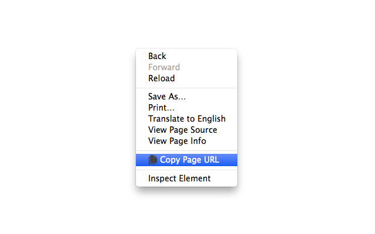

# Copy Page URL

A Google Chrome extension that allows you to copy page URL from the context menu or on click on the extension icon.

## Installation

[Download the ZIP of the latest release](https://github.com/alex7kom/Copy-Page-URL/releases/latest) and extract it wherever you want. Then open extension list page of your Chromium browser, switch to Developer mode, choose load unpacked extension and then choose the folder where you extracted the extension. Enjoy!

## Permissions

* **activeTab** - allows the extension to obtain the URL of the currently viewed web page after click on the extension icon

* **clipboardWrite** - allows the extension to put the URL into clipboard

* **contextMenus** - allows the extension to add 'Copy Page URL' and 'Copy Frame URL' items to the context menu

* **storage** - allows the extension to store extension settings in the browser storage

## Changelog

[Changelog](CHANGELOG.md)

## Privacy Policy

[Privacy Policy](PRIVACY_POLICY.md)

## License

Code: [MIT](LICENSE)

Icons: [Public Domain Copy / Clone Icon](http://openclipart.org/detail/169987/copy--clone-icon-by-ben)
